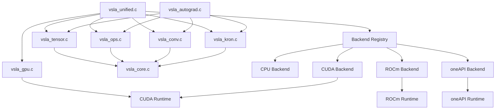

# VSLA Architecture Documentation

> **Variable-Shape Linear Algebra Library - Complete Source Code Architecture**

This document provides a comprehensive overview of the VSLA codebase architecture, designed for developers who need to understand the implementation structure at a glance.

## Table of Contents
- [Overview](#overview)
- [Core Architecture](#core-architecture)
- [Module Dependencies](#module-dependencies)
- [Source File Breakdown](#source-file-breakdown)
- [Backend System](#backend-system)
- [Data Flow](#data-flow)
- [Extension Points](#extension-points)

## Overview

VSLA implements a **hardware-agnostic tensor computation library** with automatic differentiation, supporting both CPU and GPU execution through a unified interface. The library is organized around two mathematical models:

- **Model A**: Convolution Semiring (FFT-based operations)
- **Model B**: Kronecker Product Semiring (tiled operations)

## Core Architecture

```
VSLA Architecture
├── Unified Interface (vsla_unified.c)
│   ├── Hardware-agnostic API
│   ├── Automatic CPU/GPU selection
│   └── Memory management abstraction
├── Core Tensor System (vsla_tensor.c, vsla_ops.c)
│   ├── Variable-shape tensor data structure
│   ├── Basic arithmetic operations
│   └── Memory-aligned allocation
├── Specialized Modules
│   ├── Model A: Convolution (vsla_conv.c)
│   ├── Model B: Kronecker (vsla_kron.c)
│   ├── Automatic Differentiation (vsla_autograd.c)
│   ├── GPU Acceleration (vsla_gpu.c/.cu)
│   └── I/O Operations (vsla_io.c)
├── Backend System (src/backends/)
│   ├── CPU Backend (vsla_backend_cpu.c)
│   ├── CUDA Backend (vsla_backend_cuda.c)
│   ├── ROCm Backend (vsla_backend_rocm.c)
│   ├── oneAPI Backend (vsla_backend_oneapi.c)
│   └── Registry (vsla_backend_registry.c)
└── Utilities (vsla_core.c, vsla_utils.c)
    ├── Error handling
    ├── Data type utilities
    └── Library initialization
```

## Module Dependencies



## Source File Breakdown

### Core Infrastructure

#### `vsla_core.c` - Foundation Utilities
```c
// Error handling
const char* vsla_error_string(vsla_error_t error);

// Data type utilities
size_t vsla_dtype_size(vsla_dtype_t dtype);

// Mathematical utilities
uint64_t vsla_next_pow2(uint64_t n);
bool vsla_is_pow2(uint64_t n);
```
**Purpose**: Provides fundamental utilities used throughout the library.
**Dependencies**: None (foundation layer)

#### `vsla_tensor.c` - Core Tensor Implementation
```c
// Tensor lifecycle
vsla_tensor_t* vsla_new(uint8_t rank, const uint64_t shape[], 
                        vsla_model_t model, vsla_dtype_t dtype);
void vsla_free(vsla_tensor_t* tensor);

// Data access
vsla_error_t vsla_get_f64(const vsla_tensor_t* tensor, 
                          const uint64_t indices[], double* value);
vsla_error_t vsla_set_f64(vsla_tensor_t* tensor, 
                          const uint64_t indices[], double value);

// Utilities
uint64_t vsla_numel(const vsla_tensor_t* tensor);
vsla_tensor_t* vsla_zeros(uint8_t rank, const uint64_t shape[], 
                          vsla_model_t model, vsla_dtype_t dtype);
```
**Purpose**: Implements the core variable-shape tensor data structure with memory management.
**Key Features**: 64-byte aligned memory, automatic capacity management, type-safe element access
**Dependencies**: vsla_core.h

#### `vsla_ops.c` - Basic Tensor Operations
```c
// Element-wise operations
vsla_error_t vsla_add(vsla_tensor_t* out, const vsla_tensor_t* a, const vsla_tensor_t* b);
vsla_error_t vsla_sub(vsla_tensor_t* out, const vsla_tensor_t* a, const vsla_tensor_t* b);
vsla_error_t vsla_scale(vsla_tensor_t* out, const vsla_tensor_t* tensor, double scalar);
vsla_error_t vsla_hadamard(vsla_tensor_t* out, const vsla_tensor_t* a, const vsla_tensor_t* b);

// Shape operations
vsla_error_t vsla_transpose(vsla_tensor_t* out, const vsla_tensor_t* tensor);
vsla_error_t vsla_reshape(vsla_tensor_t* tensor, uint8_t new_rank, const uint64_t new_shape[]);
vsla_error_t vsla_pad_rank(vsla_tensor_t* tensor, uint8_t new_rank, const uint64_t target_cap[]);

// Reductions
vsla_error_t vsla_sum(const vsla_tensor_t* tensor, double* sum);
vsla_error_t vsla_norm(const vsla_tensor_t* tensor, double* norm);
vsla_error_t vsla_max(const vsla_tensor_t* tensor, double* max);
vsla_error_t vsla_min(const vsla_tensor_t* tensor, double* min);
```
**Purpose**: Implements fundamental tensor operations with automatic shape compatibility.
**Key Features**: Broadcasting support, memory-efficient operations, comprehensive error checking
**Dependencies**: vsla_tensor.h, vsla_core.h

### Specialized Computational Modules

#### `vsla_conv.c` - Model A (Convolution Semiring)
```c
// Main convolution interface
vsla_error_t vsla_conv(vsla_tensor_t* out, const vsla_tensor_t* a, const vsla_tensor_t* b);

// Implementation variants
vsla_error_t vsla_conv_direct(vsla_tensor_t* out, const vsla_tensor_t* a, const vsla_tensor_t* b);
vsla_error_t vsla_conv_fft(vsla_tensor_t* out, const vsla_tensor_t* a, const vsla_tensor_t* b);

// Matrix operations in convolution semiring
vsla_error_t vsla_matmul_conv(vsla_tensor_t* out, const vsla_tensor_t* a, const vsla_tensor_t* b);

// Polynomial algebra
vsla_error_t vsla_to_polynomial(vsla_tensor_t* poly, const vsla_tensor_t* tensor);
vsla_error_t vsla_from_polynomial(vsla_tensor_t* tensor, const vsla_tensor_t* poly);

// Custom FFT implementation
static void fft_radix2(complex double* data, size_t n, bool inverse);
```
**Purpose**: Implements convolution operations with automatic algorithm selection (direct vs FFT).
**Key Features**: Custom radix-2 FFT, polynomial conversion, O(n log n) complexity for large inputs
**Dependencies**: vsla_tensor.h, vsla_ops.h, vsla_core.h

#### `vsla_kron.c` - Model B (Kronecker Product Semiring)
```c
// Main Kronecker product interface
vsla_error_t vsla_kron(vsla_tensor_t* out, const vsla_tensor_t* a, const vsla_tensor_t* b);

// Implementation variants
vsla_error_t vsla_kron_naive(vsla_tensor_t* out, const vsla_tensor_t* a, const vsla_tensor_t* b);
vsla_error_t vsla_kron_tiled(vsla_tensor_t* out, const vsla_tensor_t* a, const vsla_tensor_t* b);

// Matrix operations in Kronecker semiring
vsla_error_t vsla_matmul_kron(vsla_tensor_t* out, const vsla_tensor_t* a, const vsla_tensor_t* b);

// Monoid algebra conversion
vsla_error_t vsla_to_monoid_algebra(vsla_tensor_t* algebra, const vsla_tensor_t* tensor);
vsla_error_t vsla_from_monoid_algebra(vsla_tensor_t* tensor, const vsla_tensor_t* algebra);
```
**Purpose**: Implements Kronecker product operations with cache-optimized algorithms.
**Key Features**: Tiled implementation for cache efficiency, monoid algebra support
**Dependencies**: vsla_tensor.h, vsla_ops.h, vsla_core.h

#### `vsla_autograd.c` - Automatic Differentiation
```c
// Gradient tape management
vsla_tape_t* vsla_tape_new(void);
void vsla_tape_free(vsla_tape_t* tape);

// Operation recording
vsla_error_t vsla_tape_record(vsla_tape_t* tape, vsla_op_type_t op,
                              vsla_tensor_t** inputs, size_t num_inputs,
                              vsla_tensor_t* output, void* extra_data, size_t extra_size);

// Backward pass
vsla_error_t vsla_backward(vsla_tape_t* tape);

// Gradient management
vsla_tensor_t* vsla_get_gradient(const vsla_tape_t* tape, const vsla_tensor_t* tensor);
vsla_error_t vsla_set_gradient(vsla_tape_t* tape, const vsla_tensor_t* tensor, const vsla_tensor_t* gradient);
vsla_error_t vsla_clear_gradients(vsla_tape_t* tape);

// Backward functions
vsla_error_t vsla_add_backward(vsla_tensor_t* grad_a, vsla_tensor_t* grad_b, const vsla_tensor_t* grad_out);
vsla_error_t vsla_scale_backward(vsla_tensor_t* grad_in, double* grad_scalar, const vsla_tensor_t* grad_out, const vsla_tensor_t* input, double scalar);
```
**Purpose**: Provides automatic differentiation for machine learning workflows.
**Key Features**: Computational graph recording, reverse-mode differentiation, gradient accumulation
**Data Structures**: 
- `vsla_tape_t`: Records operation sequence for backpropagation
- `vsla_op_record_t`: Individual operation records with metadata
**Dependencies**: vsla_tensor.h, vsla_ops.h, vsla_conv.h, vsla_kron.h

### Hardware Acceleration

#### `vsla_gpu.c/.cu` - GPU Acceleration (CUDA)
```c
// Context management
vsla_gpu_context_t* vsla_gpu_init(int device_id);
void vsla_gpu_destroy(vsla_gpu_context_t* ctx);

// Memory management
vsla_gpu_tensor_t* vsla_gpu_tensor_alloc(vsla_gpu_context_t* ctx, const vsla_tensor_t* tensor);
void vsla_gpu_tensor_free(vsla_gpu_tensor_t* gpu_tensor);

// GPU operations
vsla_error_t vsla_gpu_add(vsla_gpu_tensor_t* result, const vsla_gpu_tensor_t* a, const vsla_gpu_tensor_t* b, vsla_gpu_context_t* ctx);
vsla_error_t vsla_gpu_scale(vsla_gpu_tensor_t* result, const vsla_gpu_tensor_t* tensor, double scalar, vsla_gpu_context_t* ctx);
vsla_error_t vsla_gpu_matmul(vsla_gpu_tensor_t* result, const vsla_gpu_tensor_t* a, const vsla_gpu_tensor_t* b, vsla_gpu_context_t* ctx);

// CUDA kernels (in .cu file)
__global__ void vsla_gpu_add_kernel_f32(float* result, const float* a, const float* b, size_t n);
__global__ void vsla_gpu_matmul_kernel_f32(float* C, const float* A, const float* B, int m, int n, int k);
```
**Purpose**: Provides GPU acceleration using CUDA with custom kernels.
**Key Features**: Pure CUDA implementation (no cuBLAS dependency), optimized memory access patterns
**Data Structures**:
- `vsla_gpu_context_t`: CUDA context and stream management
- `vsla_gpu_tensor_t`: GPU memory representation of tensors
**Dependencies**: CUDA Runtime, vsla_tensor.h

#### `vsla_unified.c` - Hardware-Agnostic Interface
```c
// Context management
vsla_context_t* vsla_init(const vsla_config_t* config);
void vsla_cleanup(vsla_context_t* ctx);

// Tensor management with automatic CPU/GPU handling
vsla_tensor_t* vsla_tensor_create(vsla_context_t* ctx, uint8_t rank, const uint64_t* shape, vsla_model_t model, vsla_dtype_t dtype);
void vsla_tensor_free(vsla_tensor_t* tensor);

// High-level operations (automatically select CPU/GPU)
vsla_error_t vsla_add(vsla_context_t* ctx, vsla_tensor_t* out, const vsla_tensor_t* a, const vsla_tensor_t* b);
vsla_error_t vsla_conv(vsla_context_t* ctx, vsla_tensor_t* out, const vsla_tensor_t* signal, const vsla_tensor_t* kernel);
vsla_error_t vsla_matmul(vsla_context_t* ctx, vsla_tensor_t* out, const vsla_tensor_t* a, const vsla_tensor_t* b);

// Memory management
static vsla_error_t ensure_cpu_valid(vsla_tensor_t* tensor);
static vsla_error_t ensure_gpu_valid(vsla_tensor_t* tensor);

// Performance monitoring
vsla_error_t vsla_get_stats(const vsla_context_t* ctx, vsla_stats_t* stats);
```
**Purpose**: Provides unified, hardware-agnostic interface that automatically manages CPU/GPU execution.
**Key Features**: Automatic hardware detection, transparent memory migration, performance statistics
**Data Structures**:
- `struct vsla_tensor`: Unified tensor with both CPU and GPU memory pointers
- `struct vsla_context`: Runtime context with hardware capabilities and statistics
**Dependencies**: All VSLA modules, optional CUDA

### Input/Output

#### `vsla_io.c` - Tensor Serialization
```c
// Binary format I/O
vsla_error_t vsla_save(const vsla_tensor_t* tensor, const char* filename);
vsla_tensor_t* vsla_load(const char* filename);
vsla_error_t vsla_save_fd(const vsla_tensor_t* tensor, int fd);
vsla_tensor_t* vsla_load_fd(int fd);

// CSV format support
vsla_error_t vsla_export_csv(const vsla_tensor_t* tensor, const char* filename);
vsla_tensor_t* vsla_import_csv(const char* filename, vsla_model_t model, vsla_dtype_t dtype);

// Endianness handling
static int vsla_get_endianness(void);
static void vsla_swap_bytes(void* data, size_t size);
```
**Purpose**: Handles tensor serialization to/from files in binary and CSV formats.
**Key Features**: Cross-platform endianness handling, efficient binary format, human-readable CSV export
**Dependencies**: vsla_tensor.h

### Utility Modules

#### `vsla_utils.c` - Library Management
```c
// Library initialization
vsla_error_t vsla_init(void);
void vsla_cleanup(void);

// Version information
const char* vsla_version(void);

// Feature detection
bool vsla_has_fftw(void);
bool vsla_has_gpu(void);
```
**Purpose**: Manages library-wide initialization and provides feature detection.
**Dependencies**: vsla.h (main header)

## Backend System

The backend system provides a **pluggable architecture** for hardware-specific optimizations:

### Backend Registry (`vsla_backend_registry.c`)
```c
// Registry management
vsla_error_t vsla_backend_registry_init(void);
void vsla_backend_registry_cleanup(void);

// Backend selection
const vsla_backend_interface_t* vsla_backend_get_best(vsla_backend_t preferred);
const vsla_backend_interface_t* vsla_backend_get_by_type(vsla_backend_t backend_type);

// Smart recommendations
vsla_backend_t vsla_backend_recommend(const char* operation, const vsla_tensor_t** tensors, size_t tensor_count);

// Capability queries
vsla_error_t vsla_backend_list_available(vsla_backend_t* backends, size_t* count, size_t max_count);
bool vsla_backend_supports_operation(vsla_backend_t backend_type, const char* operation);
```

### Individual Backends

#### CPU Backend (`vsla_backend_cpu.c`)
- **Purpose**: Pure CPU implementations using optimized C code
- **Features**: SIMD detection, OpenMP support, BLAS integration
- **Operations**: All operations supported as fallback

#### CUDA Backend (`vsla_backend_cuda.c`)
- **Purpose**: NVIDIA GPU acceleration using CUDA and cuFFT
- **Features**: cuFFT integration, GPU memory management
- **Operations**: Convolution (FFT), matrix operations, element-wise ops

#### ROCm Backend (`vsla_backend_rocm.c`)
- **Purpose**: AMD GPU acceleration using ROCm and rocFFT
- **Status**: Interface defined, implementation stubs
- **Dependencies**: HIP runtime, rocFFT, rocBLAS

#### oneAPI Backend (`vsla_backend_oneapi.c`)
- **Purpose**: Intel GPU/CPU acceleration using oneAPI and MKL
- **Status**: Interface defined, implementation stubs
- **Dependencies**: Intel oneAPI toolkit, MKL

## Data Flow

### Typical Operation Flow
1. **User calls unified API** (e.g., `vsla_conv(ctx, out, signal, kernel)`)
2. **Backend selection**: Registry recommends optimal backend based on tensor sizes
3. **Memory management**: Ensure data is in correct location (CPU/GPU)
4. **Execution**: Backend-specific optimized implementation
5. **Result handling**: Update tensor metadata and synchronize if needed

### Memory Management Strategy
- **Lazy allocation**: GPU memory allocated only when needed
- **Transparent migration**: Automatic CPU↔GPU transfers
- **Validity tracking**: `cpu_valid` and `gpu_valid` flags prevent unnecessary transfers
- **Threshold-based decisions**: Small tensors stay on CPU, large tensors prefer GPU

## Extension Points

### Adding New Operations
1. **Define in unified interface**: Add function to `vsla_unified.h`
2. **Implement in backends**: Add to `vsla_backend_interface_t` structure
3. **Add CPU fallback**: Implement in `vsla_backend_cpu.c`
4. **Optimize for GPU**: Implement in relevant GPU backends

### Adding New Backends
1. **Create backend file**: Follow `vsla_backend_*.c` pattern
2. **Implement interface**: All functions in `vsla_backend_interface_t`
3. **Register backend**: Add to registry initialization
4. **Test integration**: Ensure compatibility with unified interface

### Performance Optimization Points
- **CUDA kernel optimization**: Memory coalescing, occupancy
- **CPU SIMD utilization**: Vectorized operations
- **Cache optimization**: Tiled algorithms, data locality
- **Memory pool management**: Reduce allocation overhead

## Build System Integration

### CMake Configuration
```cmake
# Backend selection
option(VSLA_ENABLE_CUDA "Enable CUDA support" ON)
option(VSLA_ENABLE_ROCM "Enable ROCm support" OFF)
option(VSLA_ENABLE_ONEAPI "Enable oneAPI support" OFF)

# Conditional compilation
if(VSLA_ENABLE_CUDA)
    find_package(CUDA REQUIRED)
    target_compile_definitions(vsla PRIVATE VSLA_ENABLE_CUDA)
endif()
```

### Compilation Units
- **Always compiled**: Core modules, CPU backend
- **Conditionally compiled**: GPU backends based on available SDKs
- **Header-only**: Interface definitions in `include/vsla/`

---

## Summary

VSLA's architecture is designed for:
- **Modularity**: Clean separation between core tensor operations and specialized algorithms
- **Performance**: Hardware-specific optimizations through pluggable backend system
- **Extensibility**: Easy addition of new operations and hardware backends
- **Maintainability**: Clear module boundaries and comprehensive error handling

The dual semiring model (convolution + Kronecker) provides mathematical foundations for variable-shape tensor operations, while the unified interface abstracts hardware complexity for end users.

**For new developers**: Start with `vsla_unified.h` for the public API, then explore `vsla_tensor.c` and `vsla_ops.c` for core functionality. The backend system in `src/backends/` shows how hardware-specific optimizations are integrated.